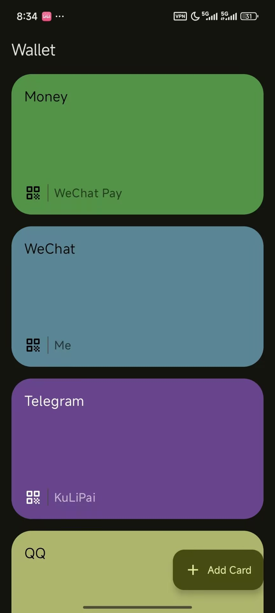
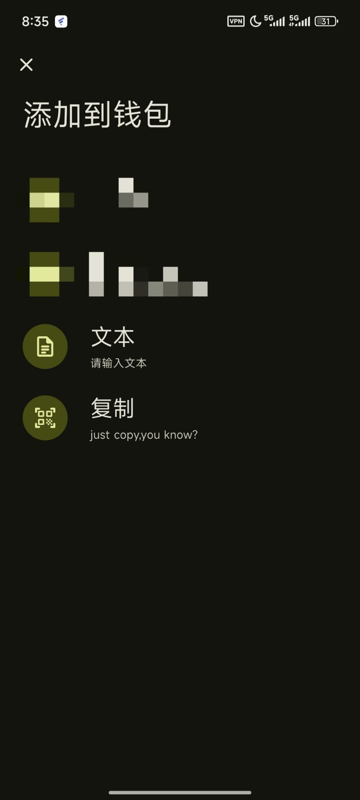

# 📱 QR Wallet

一个简洁实用的 **二维码钱包应用**，灵感来自 **Google Wallet**。
你可以像管理银行卡一样，添加、编辑和展示二维码。

支持 **输入/扫描添加二维码**，并能自定义卡片颜色和文字，方便整理和快速展示。

---

## ✨ 功能特性

* 🔑 **管理二维码**：输入文本或扫描二维码即可添加
* 🖼 **卡片视图**：以卡片形式展示二维码
* 🎨 **个性化**：支持修改卡片颜色、编辑标题/说明文字
* 📷 **扫码支持**：快速扫描并保存二维码
* 📋 **编辑功能**：长按编辑二维码内容
* 👜 **灵感来源**：参考 Google Wallet 的卡片管理方式

---

## 🖼 截图

  
  
  

---

## 🛠 技术栈

* [Kotlin](https://kotlinlang.org/)
* [Jetpack Compose](https://developer.android.com/jetpack/compose)
* [Material 3](https://m3.material.io/)
* [Hilt](https://dagger.dev/hilt/) 依赖注入
* [Accompanist Permissions](https://google.github.io/accompanist/permissions/) 权限管理
* [Qrose](https://github.com/soffes/qrose) 二维码生成
* [Scanner](https://github.com/…) 二维码扫描

## 📝 许可证

本项目仅供学习与研究使用，禁止用于商业用途。